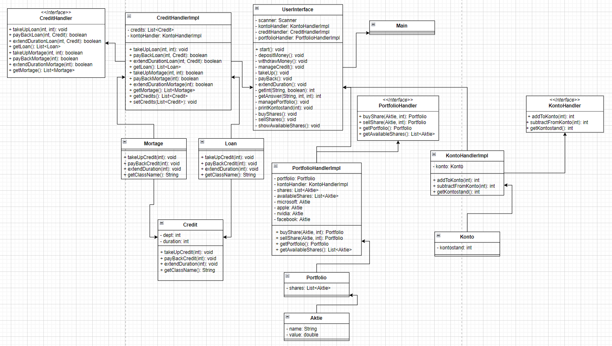

# Banking101
## Anforderungen
- Kredit aufnehmen
- Kredit zurückzahlen
- Aktuelle Kredithöhe ausgeben
- Aktien aus einer Liste kaufen und zum Portfolio hinzufügen
- Aktien aus einem Portfolio verkaufen
- Wert des Portfolios in einer Börse ermitteln

## Designpattern
Ich verwende das Designpatter "Template Method". Ich habe eine abstrakte Klasse Credit erstellt und zwei Klassen (Mortage und Loan), welche von Credit erben.

## Geplantes Klassendiagramm

## Tatsächliches Klassendiagramm

### Änderungen
CreditHandler:
Returntyp von payBackLoan geändert von int zu boolean
Returntyp von takeUpMortage von void zu boolean geändert
Returntyp von payBackMortage von int zu boolean geändert
ExtendDurationLoan und ExtendDurationMortage hinzugefügt
Credit als Attribut der Methode extendDurationLoan hinzugefügt

CreditHandlerImpl:
Field kontoHandler zu CreditHandlerImpl hinzugefügt
getCredits und setCredits zu CreditHandlerImpl hinzugefügt

UserInterface:
Field portfolioHandler zu UserInterface hinzugefügt
Methode takeUp hinzugefügt
Methode payBack hinzugefügt
Methode getInt hinzugefügt
Methode getAnswer hinzugefügt
Methode buyShares hinzugefügt
Methode sellShares hinzugefügt
Methode showAvailableShares hinzugefügt
Methode extendDuration hinzugefügt

Mortage:
Keine Fields
Methode extendDuration entfernt
Methode getClassName hinzugefügt

Loan:
Keine Fields
Methode extendDuration entfernt
Methode getClassName hinzugefügt

PortfolioHandler:
Weitere Fields hinzugefügt
Portfolio private gemacht

KontoHandlerImpl:
Konto private gemacht

Credit:
Methode getClassName hinzugefügt
Return types zu void geändert

## Sequenzdiagramm
